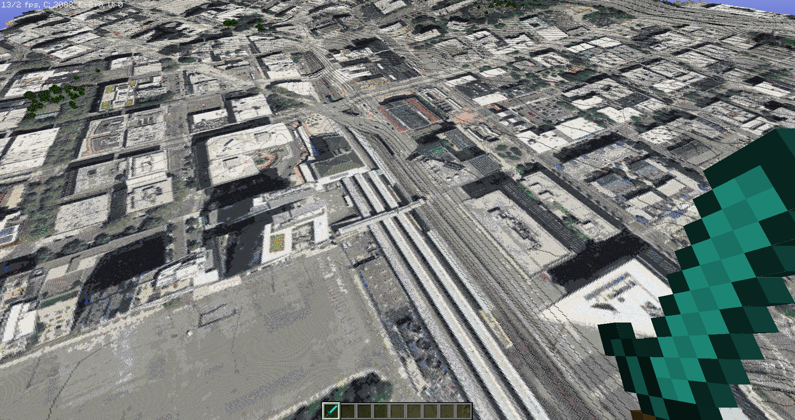
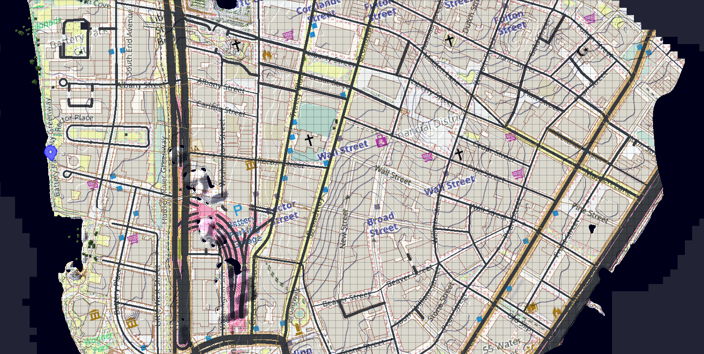
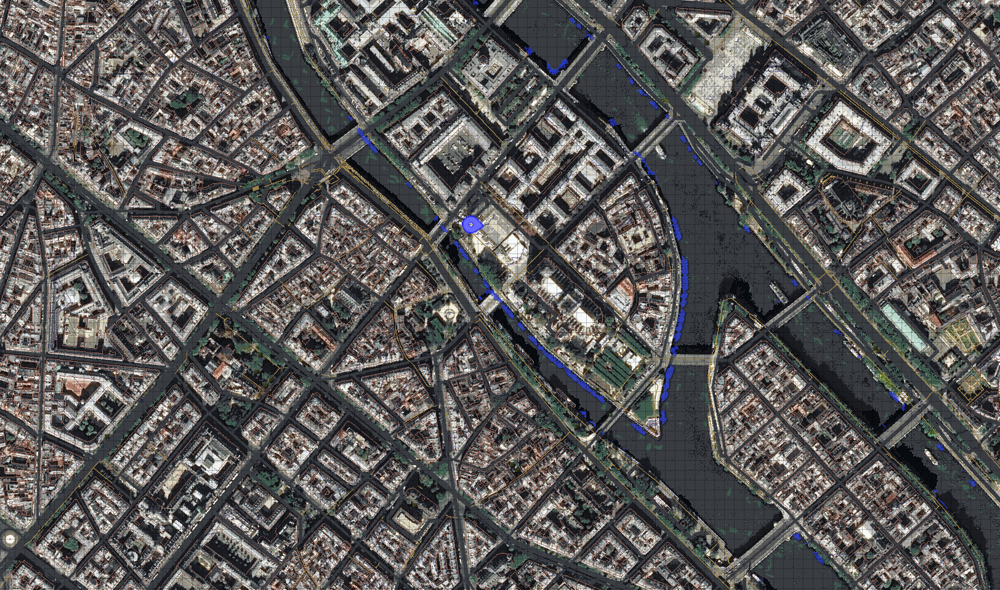
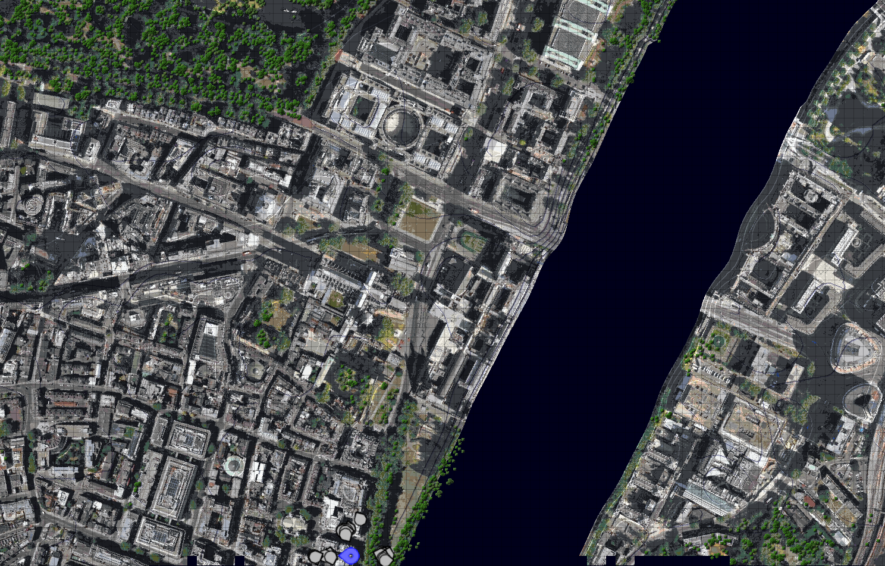

# TerraSatelliteMapper
Terra++ Add-on that generates satellite imagery data into Minecraft world.

This mod will generate images only on new chunks. it will never change old ones.
 
## Usage
 1. Download the mod from [releases](https://github.com/tf2mandeokyi/TerraSatelliteMapper/releases)
 2. Download [Terra++](https://www.curseforge.com/minecraft/mc-mods/terraplusplus) and its dependencies: [Cubic Chunks](https://www.curseforge.com/minecraft/mc-mods/opencubicchunks) and [CubicWorldGen](https://www.curseforge.com/minecraft/mc-mods/cubicworldgen)
 3. Put all the mods into the `/path/to/.minecraft/mods` folder
 4. Simply create a new "Planet Earth" world in singleplayer and watch the mod generate satellite imagery data

## Contributing
TODO

## Images
| Images | Images |
|-|-|
|  |  |
| ▲ Seattle, Bing Maps | ▲ New York, OpenStreetMap (w/ JourneyMap) |
|  |  |
| ▲ Paris, Bing Maps (w/ JourneyMap) | ▲ London, Bing Maps (w/ JourneyMap) |
