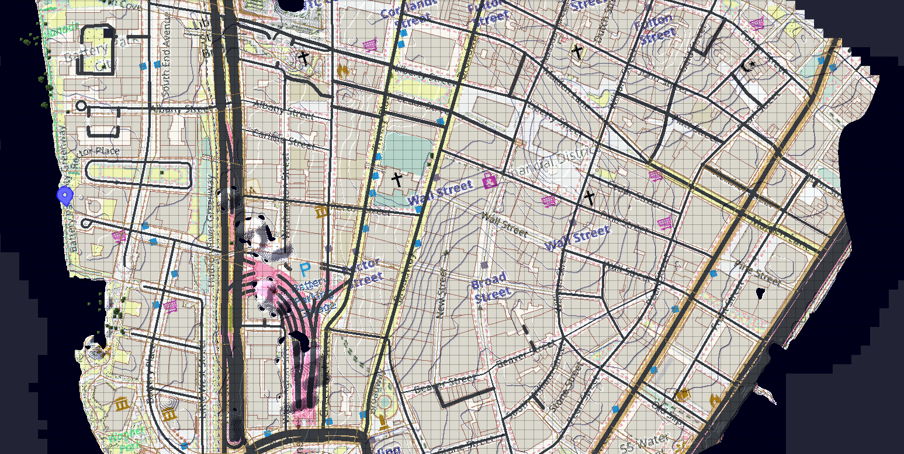

# TerraSatelliteMapper
Satellite imagery data mapper for Terra++ mod. 
⚠️This mod is still in development, so use it with your own peril.

## Usage
 1. Download the mod (TODO: Make a release)
 2. Download [Terra++](https://www.curseforge.com/minecraft/mc-mods/terraplusplus) and its dependencies: [Cubic Chunks](https://www.curseforge.com/minecraft/mc-mods/opencubicchunks) and [CubicWorldGen](https://www.curseforge.com/minecraft/mc-mods/cubicworldgen)
 3. Put all of the mods in the `mods` folder
 4. Finally, simply create a new "Planet Earth" world in singleplayer and watch the mod mapping satellite imagery data

## Contributing
TODO